# City plates

Every month since January 1940, for twenty-one cities, drawn as one grid each.

One column per year, one row per month. Read left to right and you see eighty-six
years of change; read top to bottom and you see a year. It is the contribution
graph's trick, weeks against weekdays, pointed at a longer clock.

Colour is how far that month sat from the same month's 1961-1990 average **in that
same city**. Never against another city, and never against an absolute
temperature. That is what lets Singapore and Moscow sit on the same page: one has
a seasonal swing of about two degrees and the other about thirty, and comparing
their raw readings would say nothing except that Russia is cold. Comparing each
against its own history says something.

The southern-hemisphere cities are here on purpose. Their seasons run upside down
against the month rows, which is a useful reminder that the grid is a calendar and
not a trend line.

One consequence of banding every city identically, in degrees, is that the plates
do not all read the same way. A place with a noisy climate looks like static with a
drift in it. A place with a very steady one, and Singapore is the extreme case,
sits nearly blank for seventy years and then turns solid. Singapore has warmed less
than Madrid in absolute terms and its plate is the more alarming of the two,
because a degree and a half means something different somewhere that has never
needed to cope with one.

### What this is not

It is not a climate model, a forecast, or an attribution study. It is one variable,
the daily maximum temperature, reduced to a monthly mean and drawn honestly. ERA5
is a reanalysis on a grid of roughly 25km, so these are the climates of the cell a
city sits in rather than a reading from a thermometer in it. A city that has grown
into a heat island over eighty-six years will show some of that growth as warming,
because the reanalysis does not separate the two.

### Limitations, including two the data itself has

Daily **maximum** temperature is not the same as mean temperature, and it does not
always move with it. Irrigation and airborne particulates both suppress daytime
highs while nights carry on warming, so a city can look flat here and still be
warming on an annual mean. Delhi is the clearest case on this page.

**The years before 1979 are the weakest part of the record.** ERA5's back-extension
to 1940 assimilates far fewer observations, and it is thinnest exactly where the
observing network was thinnest. Delhi's 1940s run between +0.8°C and +2.6°C and
then fall off a cliff, which is not a climate signal so much as a reanalysis
finding its feet. This is why the ranking uses the last ten years against the
1961-1990 baseline rather than against the 1940s: an earlier version ranked on the
difference between the two and handed the result to the least trustworthy thirty
years on the page.

**Lima has a discontinuity I cannot explain.** It steps from +0.8°C in 2016 to
-1.2°C in 2017 and stays there, which is a jump rather than a trend, and 2017 was
Peru's coastal El Niño, a warm event. The grid cell is not the problem: it resolves
to land at 139m, 2.4km from the city centre. I have left the city in and the plate
unaltered rather than quietly dropping it, because a project about reading data
should show where the data is worth doubting.

The Arctic complicates the other end. Reykjavik's 1940s were genuinely warm, and
its cold decades were the 1960s and 70s, so any comparison anchored on 1940 makes
it look stable when the last twenty years plainly are not.

Rebuilt every morning by a GitHub Action. Only the month in progress can change:
ERA5 publishes about five days in arrears and the past is settled, so the daily job
fetches ninety days and the other eighty-six years come from a committed table.

Built as a companion to the plates on [my profile](https://github.com/jonsut),
which do the same thing over a single year. Method and code in
[`tools/build.py`](tools/build.py).

Weather data from [Open-Meteo](https://open-meteo.com/), ERA5 reanalysis,
generated using Copernicus Climate Change Service information.
Icon from [Unicons](https://github.com/Iconscout/unicons) by Iconscout.

<!-- PLATES:START -->
<!-- Generated by tools/build.py. Edits above the marker are kept. -->

## The cities

Ranked by the last ten years. Both figures are the same city measured against its own 1961-1990 average for the same months, never against another city, so the subtraction between the two columns is yours to make. The 1940s column is the least reliable number on this page: see the limitations above.

| | City | Last decade | 1940s | Why it is here |
|---:|---|---:|---:|---|
| 1 | [Mexico City](#mexico-city) | **+3.0°C** | +0.1°C | tropical highland, 2,200m up |
| 2 | [Madrid](#madrid) | **+2.8°C** | +0.3°C | inland Mediterranean, hot and dry |
| 3 | [Anchorage](#anchorage) | **+2.7°C** | +0.6°C | sub-Arctic on the other side of the world |
| 4 | [Tokyo](#tokyo) | **+2.7°C** | +0.2°C | humid subtropical, typhoon season |
| 5 | [Moscow](#moscow) | **+2.5°C** | -0.5°C | deep continental, the widest seasonal swing |
| 6 | [Paris](#paris) | **+2.5°C** | +0.6°C | temperate, a little more continental than London |
| 7 | [London](#london) | **+2.2°C** | +0.5°C | maritime temperate, and the one on the profile |
| 8 | [Jakarta](#jakarta) | **+2.2°C** | +0.6°C | equatorial monsoon, southern side |
| 9 | [Cairo](#cairo) | **+1.8°C** | +0.7°C | hot desert, almost no rain |
| 10 | [Sydney](#sydney) | **+1.8°C** | +1.3°C | humid subtropical, seasons inverted |
| 11 | [Singapore](#singapore) | **+1.7°C** | +0.2°C | equatorial, barely a season to speak of |
| 12 | [Lagos](#lagos) | **+1.6°C** | -0.6°C | tropical monsoon, near the equator |
| 13 | [New York](#new-york) | **+1.6°C** | -0.3°C | humid continental, east-coast maritime |
| 14 | [Nairobi](#nairobi) | **+1.5°C** | +1.2°C | tropical highland, just south of the equator |
| 15 | [Beijing](#beijing) | **+1.5°C** | -0.0°C | continental monsoon, cold winters and hot summers |
| 16 | [Sao Paulo](#sao-paulo) | **+1.3°C** | -0.1°C | subtropical highland, southern hemisphere |
| 17 | [Reykjavik](#reykjavik) | **+1.0°C** | +0.8°C | sub-Arctic, and its 1940s were unusually warm |
| 18 | [Los Angeles](#los-angeles) | **+0.6°C** | -0.5°C | Mediterranean, and drought-prone |
| 19 | [Cape Town](#cape-town) | **+0.5°C** | +0.5°C | Mediterranean, seasons inverted |
| 20 | [Delhi](#delhi) | **-0.5°C** | +1.4°C | monsoon, and among the hottest big cities |
| 21 | [Lima](#lima) | **-1.7°C** | +0.0°C | coastal desert, cooled by the Humboldt current |

Last updated with data to 11 August 2026. 0 monthly values changed in this run.

### Mexico City

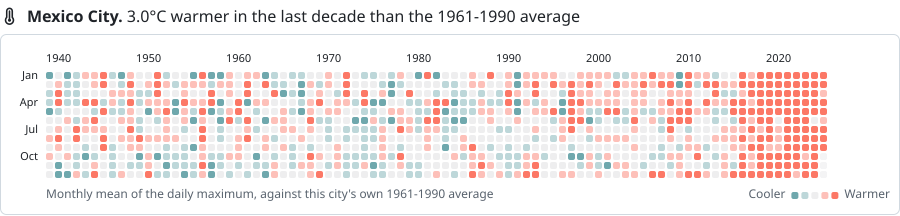

### Madrid

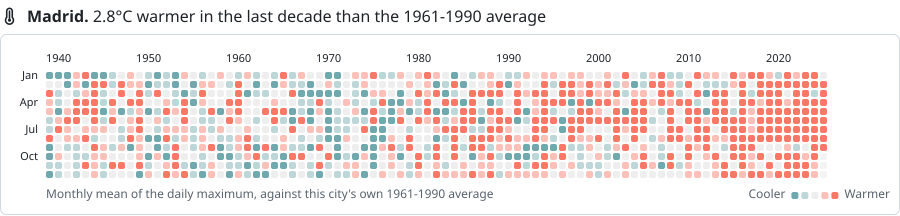

### Anchorage

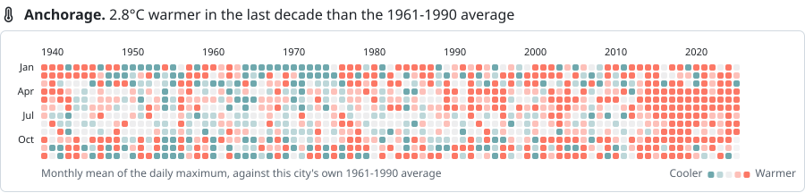

### Tokyo

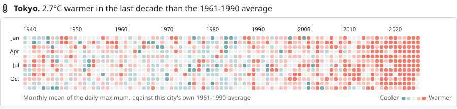

### Moscow

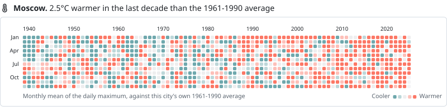

### Paris

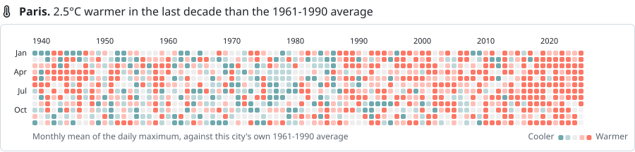

### London

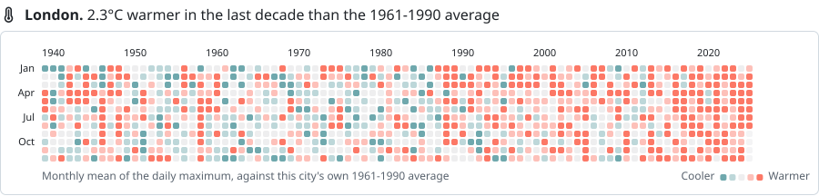

### Jakarta

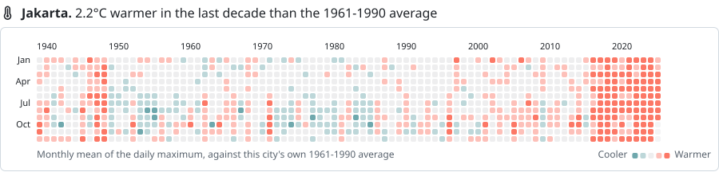

### Cairo

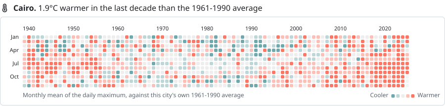

### Sydney

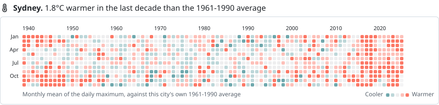

### Singapore

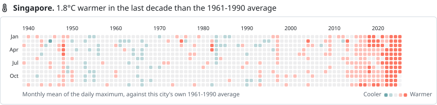

### Lagos

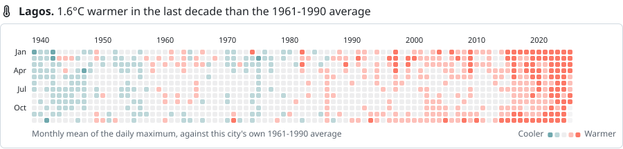

### New York

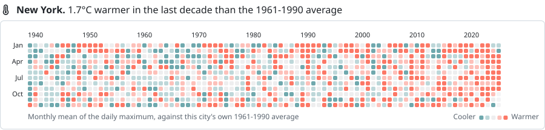

### Nairobi

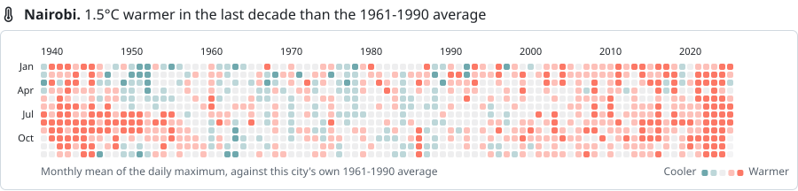

### Beijing

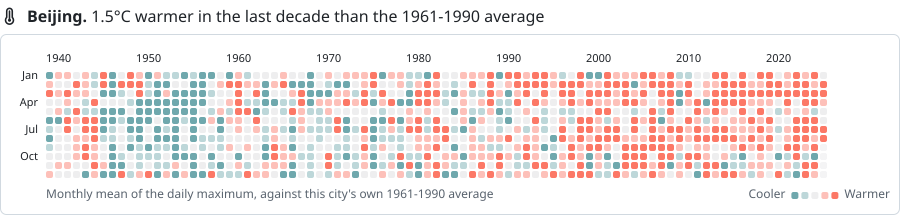

### Sao Paulo

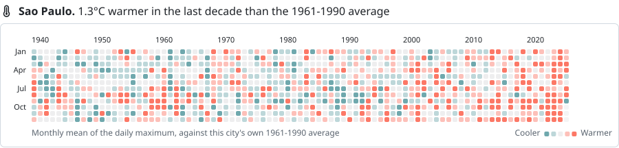

### Reykjavik

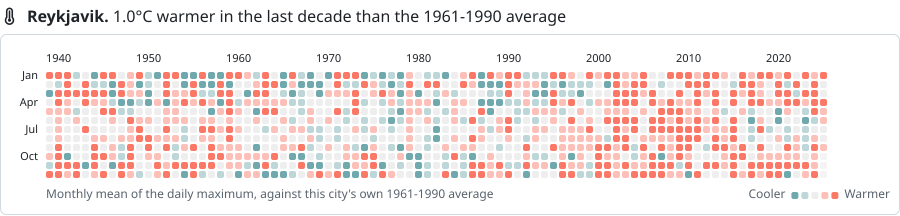

### Los Angeles

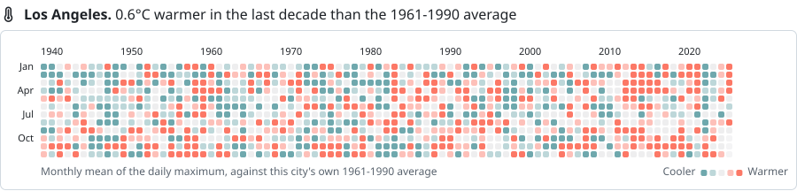

### Cape Town

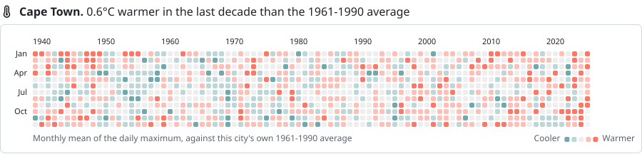

### Delhi

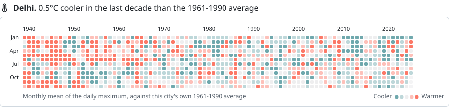

### Lima

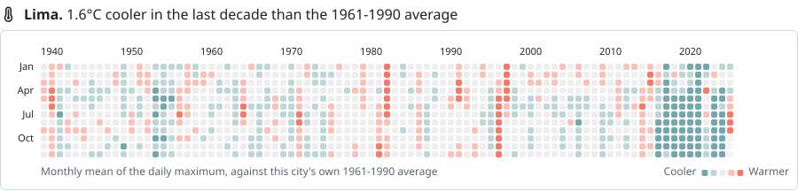
